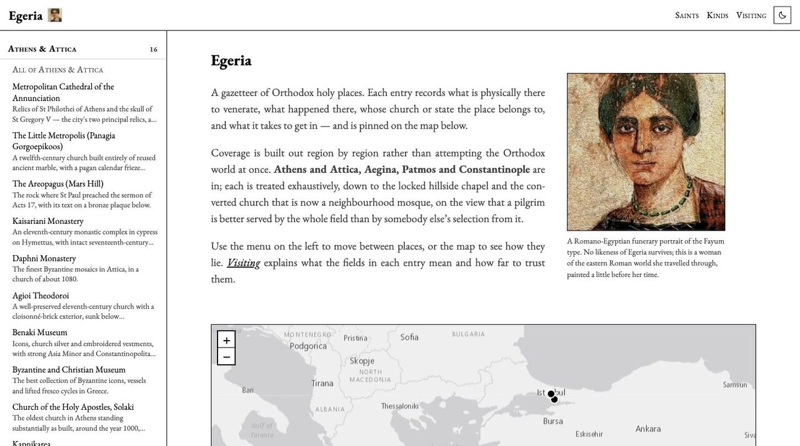
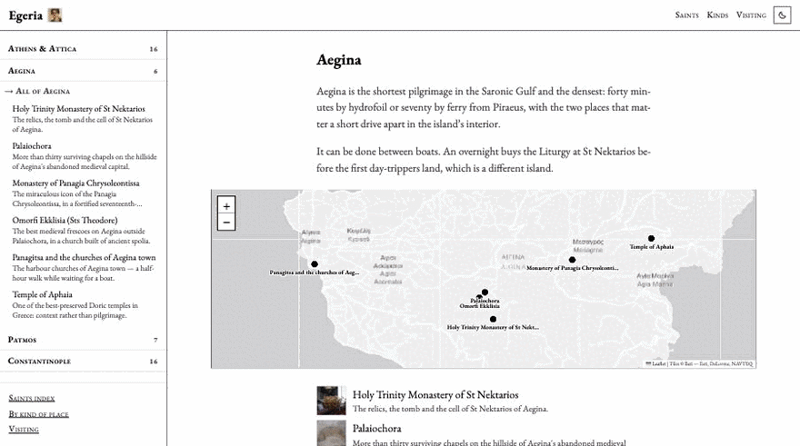
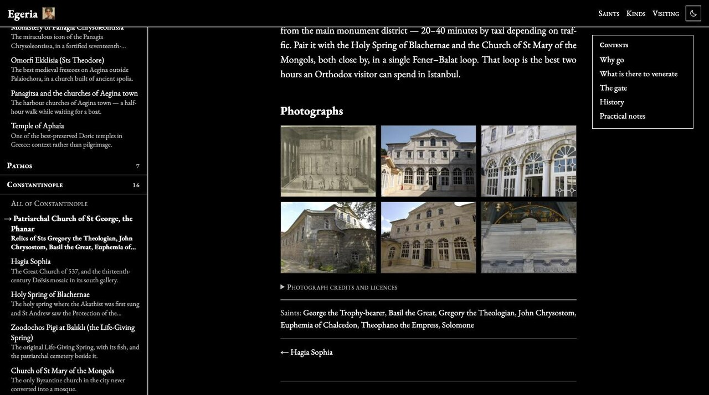
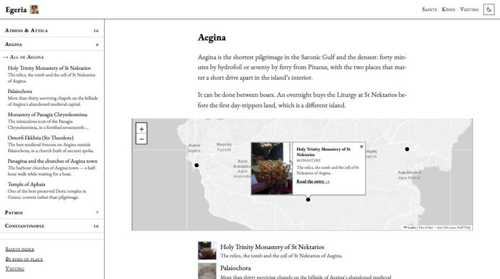

<h1 align="center">Egeria</h1>

<p align="center">
  <em>A gazetteer of Orthodox holy places — what is there to venerate,<br>
  what happened there, and what it takes to get in.</em>
</p>

<p align="center">
  
</p>

---

Egeria covers **Athens and Attica, Aegina, Patmos and Constantinople** — 48
places, each treated down to the locked hillside chapel and the converted
church that is now a neighbourhood mosque, on the view that a pilgrim is
better served by the whole field than by somebody else's selection from it.

Named for [Egeria](https://en.wikipedia.org/wiki/Egeria_(pilgrim)), the
fourth-century pilgrim whose *Itinerarium* is the oldest surviving travel
diary of the holy places.

## Using it

<p align="center">
  
</p>

<table>
<tr>
<td width="50%" valign="top">

**Every place is on a map.** Hover a pin for a photograph and a one-line
summary, click through to the entry. Pins carry their names below them once
you are zoomed in past the whole Aegean.

</td>
<td width="50%" valign="top">

**Every entry opens with the same fact block** — what is there to venerate,
whose church it is, the feast, the hours, the coordinates — then the prose,
then photographs.

</td>
</tr>
<tr>
<td width="50%" valign="top">

**The left menu is for choosing, not just navigating.** Each place carries a
line on what is actually there, so you can pick without opening anything.

</td>
<td width="50%" valign="top">

**Light and dark.** The system preference decides until you choose; then
your choice wins and is remembered.

</td>
</tr>
</table>

<p align="center">
  
</p>

## What an entry records

| | |
|---|---|
| **To venerate** | What is *physically present* and offered for veneration — never inferred from a dedication |
| **Jurisdiction** | Whose church, or that it is a state museum, a working mosque, an open ruin |
| **Feast** | The patronal feast, and the feasts of the saints whose relics are there |
| **Access** | Hours, tickets, dress, and whether you are likely to find the door locked |
| **Status** | `active` · `museum` · `mosque` · `ruin` · `open site` · `restricted` |
| **Map** | Coordinates, an OpenStreetMap link, and a pin on the regional and overview maps |

Entries carry a plain notice until they have been checked on the ground or
against a printed source. That is not boilerplate: opening hours, which
reliquaries are currently displayed, and the status of the churches
reconverted in Istanbul in 2020 and 2024 all change faster than any list can
track.

**Jurisdiction is stated as fact and left there.** Whether a visitor of one
jurisdiction should venerate in the church of another is a question for a
priest, and nothing here attempts an answer.

## Running it

```sh
make serve    # live-reloading preview at localhost:1313
make site     # build to out/site/
make check    # build with path warnings fatal
make clean
```

Needs [Hugo](https://gohugo.io/) extended — `brew install hugo`. Unlike the
sibling *materia-medica* project, which is a book that also generates a
website, this one is **web-first**: there is no PDF, and the content model is
a website's.

## Photographs

<p align="center">
  
</p>

From [Wikimedia Commons](https://commons.wikimedia.org/), fetched and audited
by `tools/fetch_photos.py`:

```sh
python3 tools/fetch_photos.py --all        # fetch what is missing
python3 tools/fetch_photos.py --optimise   # re-encode to 1200px JPEG
python3 tools/fetch_photos.py --report     # audit matches and coordinates
```

Images and their author/licence metadata are committed together, so the site
builds with no network. Most are CC BY or CC BY-SA, which **require**
attribution wherever the image appears — it is rendered in every lightbox and
in a credits list on every entry. Do not strip those fields.

Matching a photograph to a place is harder than it looks, and the fetcher
earns its guards: a plain name search for "Metropolitan Cathedral of the
Annunciation" returns cathedrals in Atlanta and Boston, and Commons files a
scale replica of Hagia Sophia in a Chinese theme park under
`Category:Hagia Sophia`. `--report` flags every image matched by proximity
alone, and every entry whose photographs cluster away from its pin — which
usually means the pin is wrong.

## Adding to it

A **place** is one Markdown file in a region folder; `make new REGION=athens
SLUG=agia-eirini` starts one from the archetype. Give it `coords` and it
appears on the maps; give it a `weight` and it sorts above the alphabetical
tail of its region. Nothing needs registering anywhere.

A **region** is a new folder with an `_index.md` carrying `region: true`, a
`weight`, a `title` and a `blurb`. The left menu, the home page, the overview
map and its filter all pick it up.

See [`CLAUDE.md`](CLAUDE.md) for the entry template, the content standards,
and the typography inherited from Materia Medica; [`log.md`](log.md) for why
things are the way they are.

## Layout

```
content/
  athens/ aegina/ patmos/ constantinople/   one file per place
  visiting/                                 guidance for every place
  saints/ kinds/                            taxonomy landing pages
layouts/                                    a small hand-rolled theme
assets/
  css/style.css                             all styling, one file
  js/                                       left menu, maps, lightbox, theme
  photos/<section>/<slug>/                  Commons photographs
  vendor/leaflet/                           Leaflet, vendored not CDN-loaded
data/photos/<section>/<slug>.yaml           author, licence, source per photo
tools/fetch_photos.py                       fetches and audits them
```

<p align="center"><sub>
Maps © <a href="https://www.openstreetmap.org/copyright">OpenStreetMap</a> contributors ·
tiles © <a href="https://www.esri.com/">Esri</a> ·
photographs from <a href="https://commons.wikimedia.org/">Wikimedia Commons</a> under their own licences
</sub></p>
